# G0JKN ShackSwitch

**Open source HF shack antenna switcher for amateur radio operators.**

**Builder:** Nigel Fenton, G0JKN (retired, UK)  
**Licence:** MIT  
**Current version:** v2.0 — Arduino Uno Q

---

## Photos

### Hardware

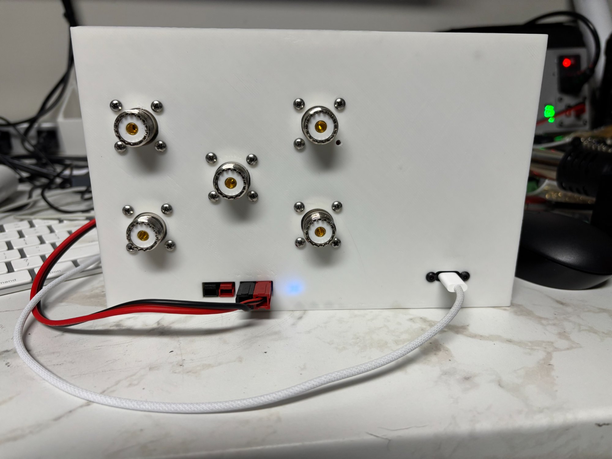

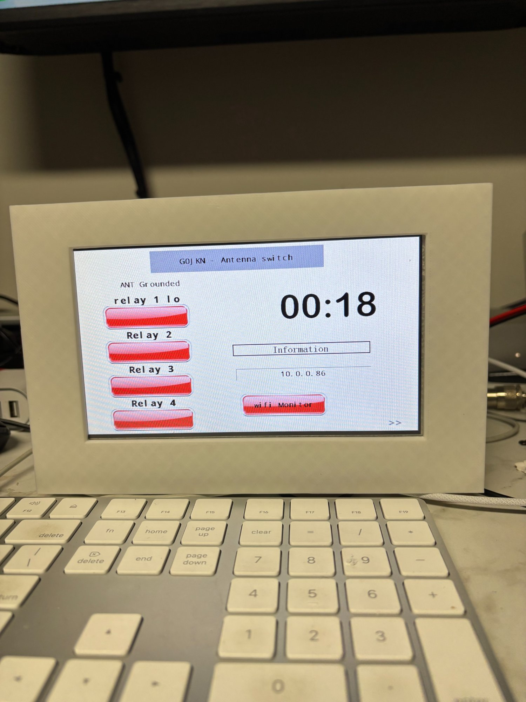

### Web Interface

**Status page** — live frequency display per radio input, active antenna highlighted in the band grid, manual override buttons. Cyan = Input A, orange = Input B.

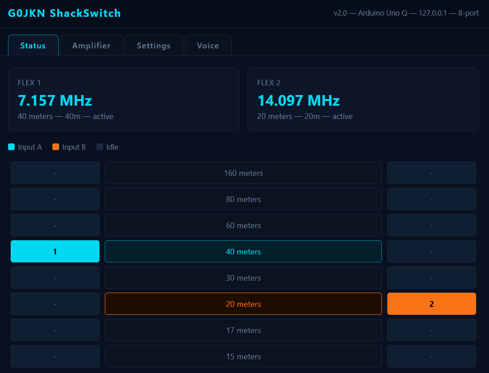

**Amplifier page** — RF-Kit RF2K-S live telemetry: forward power, reflected power, SWR, temperature, supply voltage, current.

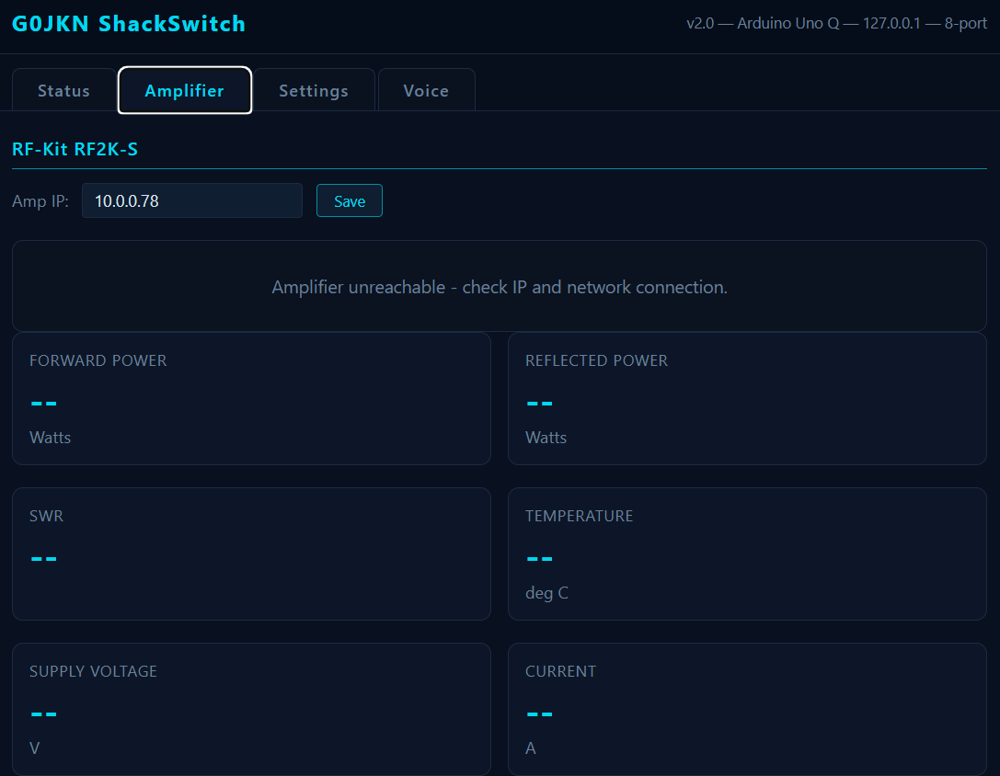

**Settings → PORTS** — number of inputs (1 = single radio, 2 = SO2R), port count, input labels, and antenna port names. MCP23017 detection shown here with SO2R-ready status.

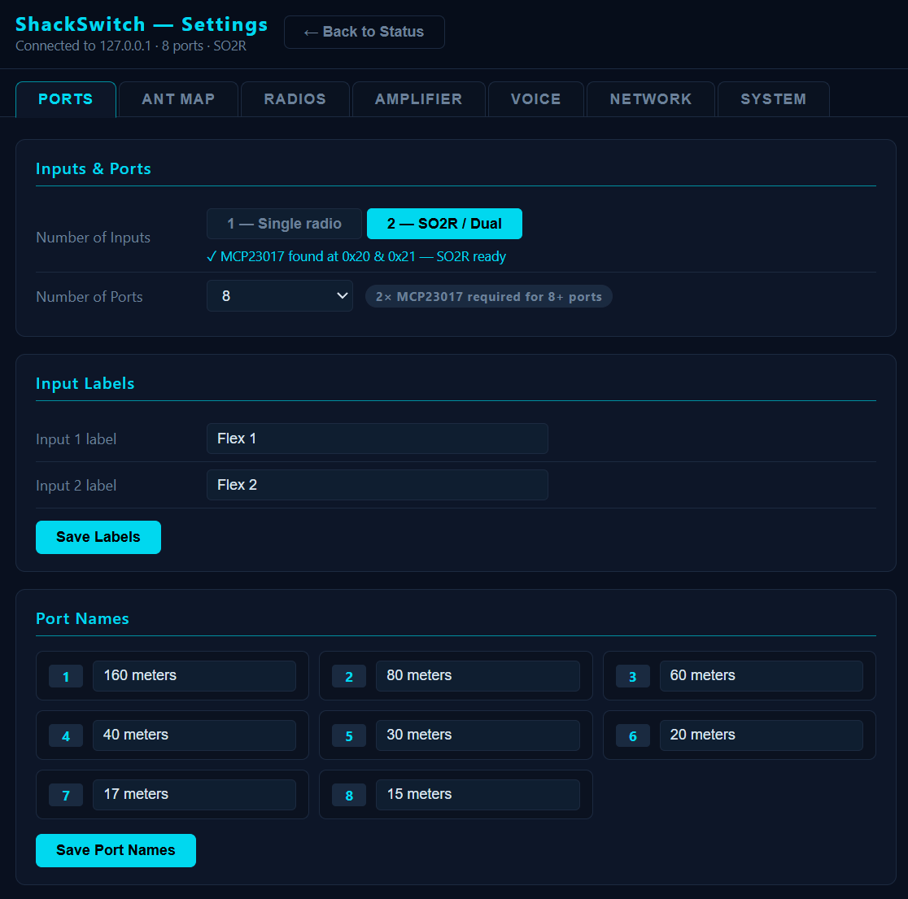

**Settings → ANT MAP** — band-to-port assignment grid. Click any cell to assign a band to a port; changes save instantly. The diagonal shows the example 8-antenna one-band-per-antenna setup.

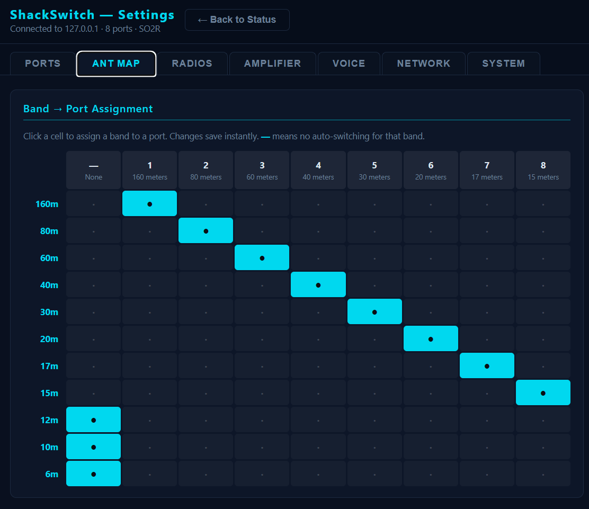

**Settings → RADIOS** — CAT radio connections. Add, edit, or remove radios here. FlexRadio/SmartSDR is configured separately and always takes priority over CAT.

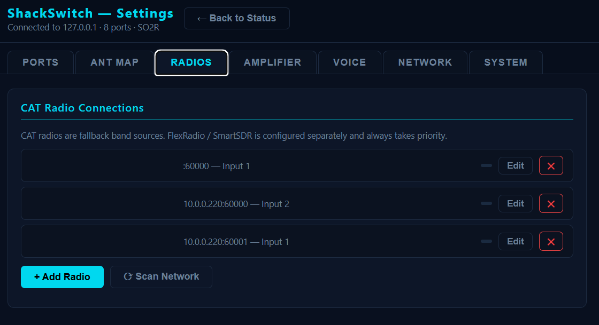

**Settings → AMPLIFIER** — RF-Kit RF2K-S IP address and port configuration.

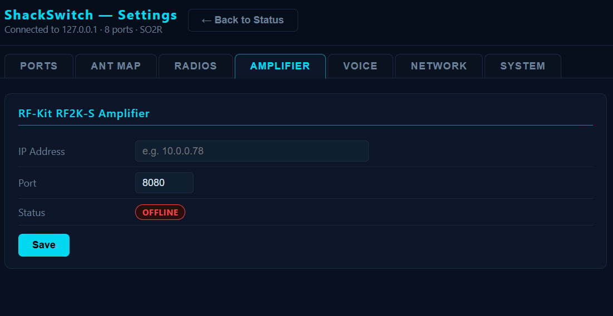

**Settings → VOICE** — links to ShackSpeak, the companion voice announcement app that monitors band changes and antenna selections.

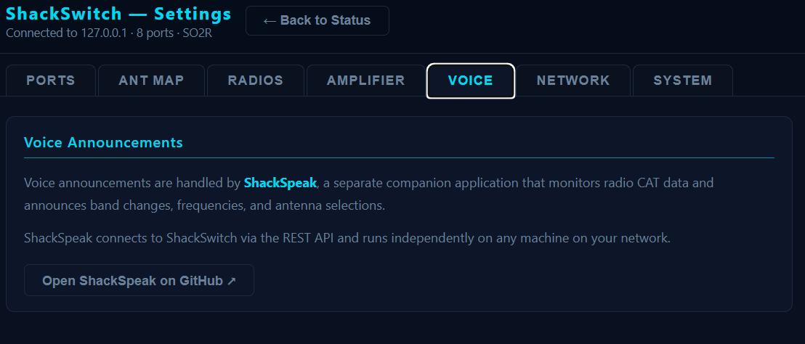

**Settings → NETWORK** — shows current WiFi connection and allows scanning for and joining a new network without SSH access.

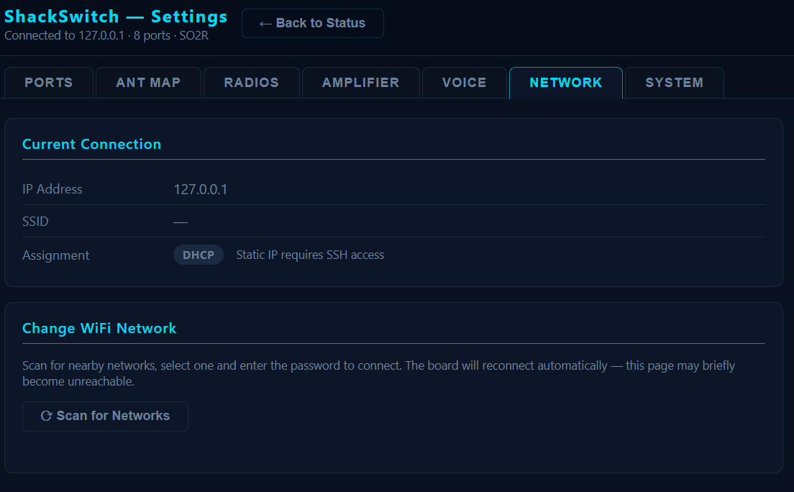

**Settings → SYSTEM** — station info (description, IARU region, ITU/CQ zone), board IP, app version and uptime, and factory reset.

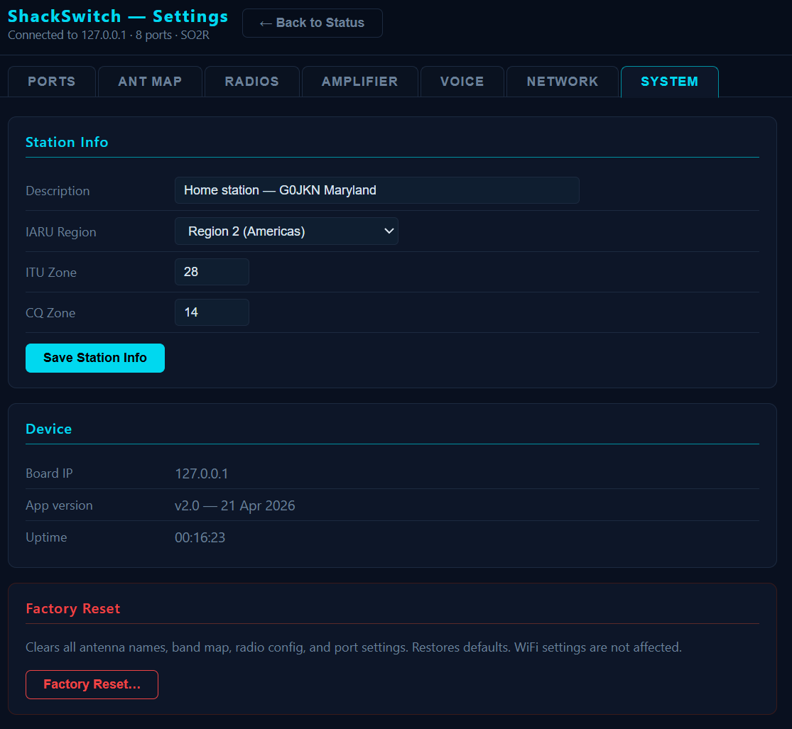

### AetherSDR Integration

**Uno Q — dual input (SO2R), INPUT A on 20m, INPUT B on 80m:**

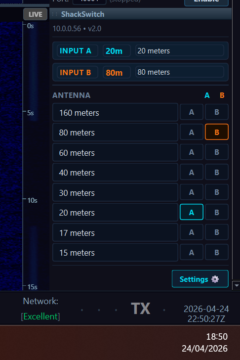

**R4 — single input, INPUT A on 40m:**

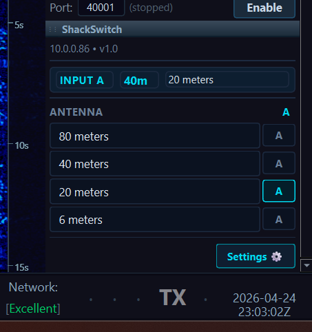

---

## What is ShackSwitch?

ShackSwitch sits between your radios and your antennas. It automatically selects the correct antenna when you change band, supports two radio inputs (SO2R capable) with hardware interlock protection, and can be controlled from any browser on your network.

It integrates with FlexRadio SmartSDR, Kenwood, Icom, and Yaesu radios — tracking band changes in real time and switching antennas automatically, with no manual intervention required.

---

## Platform — v2.0

ShackSwitch v2.0 runs on the **Arduino Uno Q** — a single board that combines a Qualcomm QRB2210 quad-core Linux processor with an STM32U585 real-time microcontroller.

- **Linux side** — Python Flask REST API, SmartSDR band tracker, radio CAT orchestrator, 4O3A Antenna Genius emulator. Runs as a Docker container, auto-started on boot.
- **STM32 side** — relay driver firmware. Loaded into RAM via OpenOCD at boot by `shackswitch-boot.sh`. Communicates with the Linux side via the Arduino Bridge RPC.
- **Web UI** — accessible from any browser on the network at `http://[board-ip]:5000/`

No separate Raspberry Pi or Arduino R4 is required.

---

## Features

### Antenna Switching
- Automatic antenna switching triggered by band changes from connected radios
- 2–16 configurable antenna ports (defaults to 8)
- Two radio input ports (SO2R) with hardware interlock — prevents both inputs selecting the same antenna simultaneously
- KK1L 2x6 relay board support via MCP23017 I2C GPIO expander (built and tested)
- G0JKN custom relay shield support (NPN/PNP driver, 12V coils)
- Band-to-antenna assignment grid — configurable per antenna per band

### Radio Interfaces
ShackSwitch tracks band changes from any combination of the following:

| Protocol | Supported Models |
|---|---|
| **FlexRadio SmartSDR** | FlexRadio 6000/7000 series via TCP port 4992 |
| **Kenwood CAT** | TS-450SAT, TS-480HX, TS-590, TS-890S, Elecraft K3/K4 |
| **Yaesu CAT** | FT-845, FT-891, FT-991A, FT-DX10, FT-817/818 |
| **Icom CI-V** | IC-9700, IC-7300, IC-705, IC-7610 |

Each radio runs in its own background thread with automatic reconnection. Serial and network transports are both supported.

### Web UI
- Live antenna selection display with manual switching
- Live frequency display per radio input
- SO2R interlock status
- Settings grid — port count, input labels, antenna names, band assignments
- Profile-based configuration — save and switch between different station setups
- Voice control — Web Speech API for TTS readback and voice commands

### Integration
- **4O3A Antenna Genius emulator** — ShackSwitch advertises itself as an Antenna Genius device over UDP/TCP (port 9007), making it discoverable and controllable by AetherSDR and other compatible software
- **REST API** — full HTTP endpoint set for external control and integration
- **Profile system** — multiple named configurations, switchable at runtime

---

## Hardware

| Item | Detail |
|---|---|
| Main board | Arduino Uno Q (Qualcomm QRB2210 Linux + STM32U585) |
| Relay shield | G0JKN custom shield — NPN/PNP drivers, 12V relay coils |
| Relay expander | KK1L 2x6 relay board with MCP23017 I2C GPIO expanders |
| RF connectors | SO239 — 1–2 radio inputs, up to 16 antenna outputs |
| Radio | FlexRadio 6700 (primary), Kenwood/Yaesu/Icom via CAT |
| Power | 12V DC |

---

## Wiring

### Nextion Display

Connect the Nextion to the Arduino Uno Q header pins as follows:

| Nextion pin | Uno Q pin |
|---|---|
| GND | GND |
| +5V | 5V |
| TX | **D0** (RX) |
| RX | **D1** (TX) |

> ⚠️ **Critical — use D0/D1, not D2/D3.**
> The Uno Q Zephyr OS maps serial ports as follows:
> - `Serial` → internal SoC↔STM32 link (`ttyHS1`) — **never use this for peripherals**
> - `Serial1` → D0/D1 header pins → **this is the Nextion connection**
>
> If you connect to D2/D3 the display will receive nothing. All sketch Nextion functions (`nextion_cmd`, `nextion_poll_serial`, etc.) call `Serial1`, which physically drives D0/D1.

📷 *Photo: close-up of D0/D1 jumper wires on the Uno Q header, with labels*

### MCP23017 I2C (KK1L Relay Board)

| MCP23017 pin | Uno Q pin |
|---|---|
| SDA | SDA (A4) |
| SCL | SCL (A5) |
| VCC | 3.3V (check board spec) |
| GND | GND |
| A0, A1, A2 | GND (I2C address 0x20) |

> If you have address conflicts on the I2C bus, tie A0/A1/A2 to different combinations of GND/VCC to select addresses 0x20–0x27.

📷 *Photo: MCP23017 / KK1L board wired to Uno Q SDA/SCL*

### USB-C Port Gotcha

The Uno Q has two USB-C ports. One is programming/console only; the other is the host USB port used for serial radio adapters. **If USB serial devices don't appear as `/dev/ttyUSB*`, try flipping the USB-C cable** — the host port is orientation-sensitive.

---

## How It Works

```
FlexRadio / Kenwood / Yaesu / Icom
         │ CAT / SmartSDR TCP
         ▼
┌─────────────────────────────────────────┐
│  Arduino Uno Q — Linux side             │
│                                         │
│  radios.py  ──► band change event       │
│                      │                  │
│  main.py (Flask) ◄───┘                  │
│  - REST API :5000                       │
│  - AG emulator :9007                    │
│  - Web UI                               │
│          │ Bridge RPC                   │
└──────────┼──────────────────────────────┘
           │
┌──────────▼──────────────────────────────┐
│  STM32U585 — real-time side             │
│  sketch.ino                             │
│  - Relay driver (direct GPIO)           │
│  - MCP23017 I2C (KK1L board)           │
│  - DIP switch config                    │
└─────────────────────────────────────────┘
           │
    Relay outputs ──► Antennas 1–16
```

### Boot Sequence

On power-up, `shackswitch-boot.sh` (run by systemd):
1. Restarts the `arduino-router` service and waits for its socket
2. Uses OpenOCD to load `sketch.ino.bin` into STM32 RAM
3. Waits for Bridge registration
4. Starts the ShackSwitch Docker container

### SO2R Interlock

When two radios are active:
- If both attempt to use the same antenna — Input B is inhibited
- If both are on the same band — Input B is inhibited
- Interlock state is shown live in the web UI and pushed to connected AetherSDR clients

---

## REST API

| Endpoint | Description |
|---|---|
| `GET /status` | Full status — relay states, bands, SO2R, interlock |
| `GET /radios/status` | CAT radio connection states and current bands |
| `GET /select?input=[a\|b]&port=[n]` | Select antenna port for input A or B |
| `GET /setband?input=[1\|2]&band=[name]` | Set band for input (e.g. `40m`) |
| `GET /bandmap` | Get band-to-antenna assignment map |
| `GET /assign` | Set band-to-antenna assignment |
| `GET /rename` | Rename an antenna port |
| `GET /rename_bulk` | Rename multiple ports in one call |
| `GET /profile` | Get current profile |
| `POST /profile` | Switch or save a profile |
| `GET /config/ports` | Get port count configuration |
| `POST /config/ports` | Set port count (2–16) |
| `GET /factory_reset` | Reset configuration to defaults |
| `GET /kk1l/status` | KK1L relay board status |
| `GET /kk1l/setband` | Drive KK1L board for a band change |

---

## 4O3A Antenna Genius Emulation

ShackSwitch emulates a 4O3A Antenna Genius device so that AetherSDR can discover and connect to it as a peripheral.

- **UDP discovery** — broadcasts on port 9007 every 5 seconds
- **TCP protocol** — implements `antenna list`, `band list`, `port get`, `sub port all`, `sub relay`, and `ping` commands
- Antenna count and band masks are derived from the active profile

See [shackswitch-v2/AETHERSDR-PROTOCOL.md](shackswitch-v2/AETHERSDR-PROTOCOL.md) for full protocol documentation.

> **Status (April 2026):** Full two-way integration is working — ShackSwitch is auto-discovered by AetherSDR, displays as a dedicated ShackSwitch applet showing live band and antenna selection for both inputs (R4: single input; Uno Q: dual input SO2R). Pull request [#2214](https://github.com/ten9876/AetherSDR/pull/2214) is open against the upstream AetherSDR repository; all CI checks passing.

---

## Radio CAT Configuration

Radios are configured in `config.json` under the `radios` key. Each radio entry specifies protocol, transport, and which ShackSwitch input it maps to.

```json
{
  "radios": {
    "a": {
      "label":     "IC-7300",
      "enabled":   true,
      "protocol":  "icom",
      "transport": "serial",
      "device":    "/dev/ttyUSB0",
      "baud":      9600,
      "civ_address": "0x94",
      "input":     "1"
    },
    "b": {
      "label":     "TS-890S",
      "enabled":   true,
      "protocol":  "kenwood",
      "transport": "network",
      "host":      "192.168.1.50",
      "port":      60000,
      "input":     "2"
    }
  }
}
```

FlexRadio SmartSDR is configured separately — `smartsdr.py` connects to the radio's TCP port 4992 and calls `/setband` on band changes.

---

## Repository Structure

```
shackswitch/
├── shackswitch-v2/          — current v2.0 source
│   ├── main.py              — Flask REST API, AG emulator, profile/config management
│   ├── radios.py            — multi-protocol radio CAT orchestrator
│   ├── radio_kenwood.py     — Kenwood CAT driver
│   ├── radio_yaesu.py       — Yaesu CAT driver
│   ├── radio_icom.py        — Icom CI-V driver
│   ├── radio_driver.py      — shared transport and band utilities
│   ├── smartsdr.py          — FlexRadio SmartSDR band tracker
│   ├── kenwood.py           — legacy standalone Kenwood interface (superseded by radios.py)
│   ├── sketch.ino           — STM32U585 relay firmware
│   ├── deploy.sh            — one-command deployment to any Uno Q board
│   ├── templates/           — Flask HTML templates (web UI pages)
│   ├── migrate_config.py    — config format upgrade tool
│   └── AETHERSDR-PROTOCOL.md — 4O3A Antenna Genius protocol documentation
├── services/
│   ├── shackswitch-boot.sh  — boot script: OpenOCD STM32 load + Docker start
│   └── shackswitch.service  — systemd service file
├── firmware/                — legacy Arduino R4 firmware (v1.5, historical)
├── nodered/                 — legacy Node-RED/Pi files (historical)
├── nextion/                 — legacy Nextion HMI files (historical)
└── docs/                    — legacy v1.5 README and project notes
```

---

## Version History

| Version | Platform | Key Changes |
|---|---|---|
| **2.0** | **Arduino Uno Q** | Complete rewrite — Flask REST API on Linux, STM32 relay firmware, Docker container, Bridge RPC, multi-protocol radio CAT (Kenwood/Yaesu/Icom/FlexRadio), KK1L board support, profile system, voice control, 4O3A AG emulation, 2–16 configurable ports |
| 1.5 | Arduino R4 WiFi + Raspberry Pi | TCP control protocol, UDP discovery, FlexRadio band tracking, SO2R interlock, Nextion band display |
| 1.4 | Arduino R4 WiFi | Antenna name labels, live JSON web updates |
| 1.3 | Arduino R4 WiFi | Dual-state image buttons on Nextion |
| 1.2 | Arduino R4 WiFi | NTP time sync, station monitor page, factory reset |
| 1.1 | Arduino R4 WiFi | WiFi web server, web-based antenna control, EEPROM name storage |
| 1.0 | Arduino R4 WiFi | Initial release — 4 relay antenna switching, Nextion display |

---

## Deploying to a New Board

A deploy script is included to get ShackSwitch running on a fresh Arduino Uno Q in one command.

### How the Board Becomes Reachable

The Arduino Uno Q runs Linux. Flask and the Docker container start automatically on every power-up — no USB connection is needed for the app to run.

What changes with USB is **network access**:

| State | What's running | Can you reach it? |
|---|---|---|
| Power only, no WiFi | Flask running on port 5000 | ❌ No — board has no network IP |
| Power + WiFi connected | Flask running on port 5000 | ✅ Yes — `http://[wifi-ip]:5000` from any device on your network |
| Power + USB (App Lab) | Flask running on port 5000 | ✅ Yes — USB network link gives the board a local IP even without WiFi |

When you plug in USB and launch App Lab, the Uno Q presents a **USB network interface** on your computer (Windows shows it as an RNDIS/USB Ethernet adapter). The board gets a USB link-local IP address — App Lab's web interface uses this to let you reach the board. The ShackSwitch web UI at port 5000 is accessible over that same USB link.

**This is the first-time WiFi setup path:**
1. Power up the board (no WiFi yet)
2. Plug in USB → launch App Lab on your computer
3. App Lab connects — board is now reachable over the USB network
4. Open `http://[usb-ip]:5000` in your browser (check App Lab for the board's USB IP address)
5. Go to **Settings → NETWORK** → scan for networks → select your SSID and enter the password → Connect
6. Board joins your WiFi and gets a permanent IP (shown on screen / in App Lab)
7. Unplug USB — from now on use `http://[wifi-ip]:5000` directly

> **Note:** `127.0.0.1` (localhost) refers to *your own computer*, not the board. You cannot use `http://127.0.0.1:5000` in a browser on your PC to reach the board — you need either the WiFi IP or the USB network IP.

---

### Prerequisites

- Arduino Uno Q plugged in via USB-C to your computer
- **App Lab first-run wizard** completed — connect the board to your WiFi network. App Lab displays the board's IP address at the end of setup. Note it down — that's what you pass to the deploy script. It also creates `user:first-app` which ShackSwitch deploys into.
- SSH key set up for the board (see Arduino Uno Q docs)
- This repo cloned to your machine

### Deploy

```bash
cd shackswitch-v2
./deploy.sh 10.0.0.XX    # use the IP shown by App Lab during setup
```

The script will:
1. Copy all Python files and templates to the board
2. Ensure `app.yaml` exposes both ports — **5000** (web UI) and **9007** (AG emulator)
3. Restart the app — flashes the STM32 sketch and starts the Python container

If your SSH key is not at one of the standard locations (`~/.ssh/id_ed25519`, `~/.ssh/id_rsa` etc.) you can override it:

```bash
SSH_KEY=~/.ssh/my_custom_key ./deploy.sh 10.0.0.XX
```

### After Deployment

1. Open `http://10.0.0.XX:5000` in a browser
2. Go to **Settings → PORTS** — name your antenna ports
3. Go to **Settings → ANT MAP** — assign bands to ports (click the grid cell to assign, saves instantly)
4. In **AetherSDR → Radio Setup → Peripherals**, set the ShackSwitch IP to your board IP

> **Note:** Each board starts with a fresh default config — antenna names and band assignments are set up via the web UI after deployment. WiFi and network settings are handled by the Uno Q OS, not ShackSwitch.

---

## udev Rules

To give serial radio adapters persistent device names on the Uno Q, create `/etc/udev/rules.d/99-shackswitch.rules`:

```
# Icom CI-V — Prolific USB-serial adapter
SUBSYSTEM=="tty", ATTRS{idVendor}=="067b", ATTRS{idProduct}=="2303", SYMLINK+="ttyICOM"

# Kenwood / Yaesu — FTDI USB-serial adapter
SUBSYSTEM=="tty", ATTRS{idVendor}=="0403", ATTRS{idProduct}=="6001", SYMLINK+="ttyKENWOOD"
```

Apply without rebooting:
```bash
sudo udevadm control --reload-rules && sudo udevadm trigger
```

Use the symlink in `config.json` (e.g. `"device": "/dev/ttyICOM"`) so the path survives USB re-plug events.

To find vendor/product IDs for an unknown adapter: `lsusb` or `udevadm info -a -n /dev/ttyUSB0 | grep -E "idVendor|idProduct"`.

---

## Key Configuration Settings

The main config file lives at `~first-app/app/config.json` on the board (or `/app/config.json` inside the running Docker container).

| Key | Default | Description |
|---|---|---|
| `ports` | `8` | Number of antenna ports (2–16) |
| `inputs` | `2` | Radio inputs — `1` = single, `2` = SO2R |
| `station.serial` | `"G0JKN-001"` | Station identifier used in AG beacon |
| `station.name` | `"ShackSwitch"` | Display name shown in AetherSDR |
| `smartsdr.host` | `""` | FlexRadio IP address (empty = disabled) |
| `smartsdr.port` | `4992` | SmartSDR TCP port |
| `kk1l.enabled` | `false` | Enable KK1L relay board via MCP23017 |
| `kk1l.i2c_address` | `"0x20"` | MCP23017 I2C address |
| `rf2ks.host` | `""` | RF2K-S amplifier IP (empty = disabled) |

> **AetherSDR identification:** `station.serial` must start with `G0JKN` **or** `station.name` must contain `ShackSwitch` (case-insensitive) for AetherSDR to show the dedicated ShackSwitch applet instead of a generic Antenna Genius panel.

📷 *Screenshot: Settings → SYSTEM page showing station serial and name fields*

---

## Nextion Display — Page Map

Navigation is driven entirely by Python (`nextion.py`). The HMI Touch Release events send `printh 23 02 54 NN` byte sequences (where `NN` is the button code); Python reads those events and issues numeric `page N` commands back to the display.

| Page | Name | Content |
|---|---|---|
| 0 | Splash | ShackSwitch logo, firmware version, **SKIP** button |
| 1 | Single (Main) | Input A band, active antenna, NEXT / PREV |
| 2 | SO2R | Input A and B side-by-side, antenna, interlock state |
| 3 | RSSI | Signal level bars (future) |
| 8 | WiFi | SSID, IP address, signal strength, **BACK** |

### Navigation flow

```
[Boot] → page 0 (splash, 20s auto-advance) → page 1
page 1 → NEXT → page 2 → NEXT → page 3 → NEXT → page 8
page 8 → BACK → page 0 (splash)
```

> **Serial port note:** The Nextion must be connected to D0/D1 (`Serial1` in the sketch). `Serial` is the internal SoC↔STM32 link and cannot be used for the display.

📷 *Photo: Nextion 7" display showing the SO2R page 2 with both inputs active*

---

## Troubleshooting

| Symptom | Likely Cause | Fix |
|---|---|---|
| Nextion stays on splash page | Wrong serial port in sketch | Confirm sketch uses `Serial1.begin(9600)` (D0/D1), not `Serial.begin()` |
| Display shows garbage | Baud mismatch | Both sketch and Nextion HMI must be set to 9600 baud |
| No relay clicks | STM32 sketch not loaded | Check boot script ran: `journalctl -u shackswitch.service` |
| Web UI not reachable at `:5000` | Container not running | `ssh first-app@[ip]` → `docker ps` |
| AetherSDR can't discover ShackSwitch | AG beacon not running | `ss -ulnp \| grep 9007` inside container — check port 9007 UDP |
| AetherSDR shows "Antenna Genius" label | Station name/serial mismatch | Ensure `station.serial` starts with `G0JKN` or `station.name` contains `ShackSwitch` |
| Serial radio not found (`/dev/ttyUSB*` missing) | USB-C orientation | Flip USB-C cable on Uno Q host USB port |
| Band changes not tracked | CAT radio disconnected | Check Settings → RADIOS; verify IP/port/device path; check radio is powered |
| SO2R interlock triggered unexpectedly | Both inputs on same band | This is correct behaviour — interlock clears when bands differ |
| Relay state lost on restart | Known issue — state not persisted | Roadmap item; workaround: re-select band from web UI after restart |

---

## Key File Locations (on the Board)

| File | Path on board | Purpose |
|---|---|---|
| Main config | `~first-app/app/config.json` | All station settings — ports, radios, profiles |
| Boot script | `/usr/local/bin/shackswitch-boot.sh` | Loads STM32 firmware, starts Docker container |
| systemd service | `/etc/systemd/system/shackswitch.service` | Runs boot script on power-up |
| STM32 firmware | `~first-app/app/sketch.ino.bin` | Relay driver binary, loaded into STM32 RAM by OpenOCD |
| Python app | `~first-app/app/*.py` | Flask REST API, radio drivers, AG emulator |
| Nextion module | `~first-app/app/nextion.py` | Nextion display driver and page navigation |
| Templates | `~first-app/app/templates/` | Web UI HTML pages |

📷 *Screenshot: SSH terminal showing `docker ps` output with the shackswitch container running*

---

## Licence

Released under the **MIT Licence**. Free to use, modify and distribute for personal or commercial purposes. Attribution to G0JKN appreciated but not required.

---

## About

Built by **G0JKN/W3** — a retired amateur radio operator keeping the mind sharp one solder joint at a time.

Feedback, suggestions and pull requests welcome.

*73 de G0JKN*
